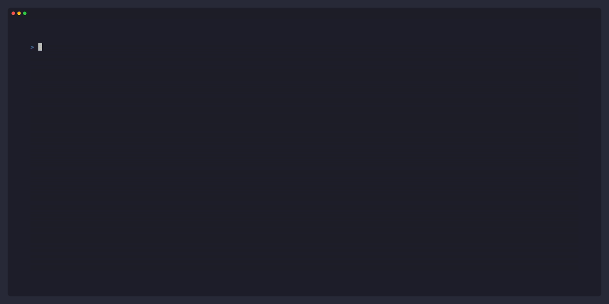

# FemtoVLLM 🚀

**FemtoVLLM** is a minimalistic, high-performance LLM inference engine built from scratch. It serves as a testbed for deconstructing and verifying state-of-the-art inference optimizations, including **PagedAttention**, **Prefix Caching**, and **Custom CUDA/Triton Kernels**, designed specifically for single-GPU environments.

## 🗺️ Roadmap

- [x] **Phase 1**: Study `nanoGPT` for Transformer basics and auto-regressive generation.
- [x] **Phase 2**: Study `nano-vllm` for KV Cache and basic PagedAttention concepts.
- [x] **Phase 3**: Implement custom pure SIMT CUDA kernels (FlashAttention, PagedAttention GEMM/GEMV) and a Prefix-Tree Native Scheduler (v3) for Prompt Caching.
- [ ] **Phase 4 (WIP)**: Port core attention kernels to **OpenAI Triton** to achieve higher throughput and lower TTFT (Time To First Token) compared to naive implementations.
- [ ] **Phase 5**: Upgrade to a RadixTree-Native Scheduler, unifying scheduling and memory allocation into a single C++ backend.

## 📚 References
- [nanoGPT](https://github.com/karpathy/nanoGPT)
- [nano-vllm](https://github.com/GeeeekExplorer/nano-vllm)
