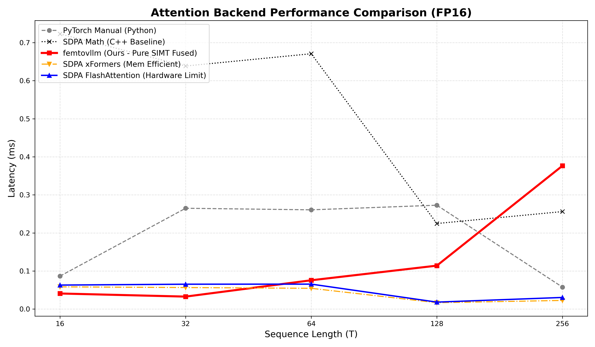
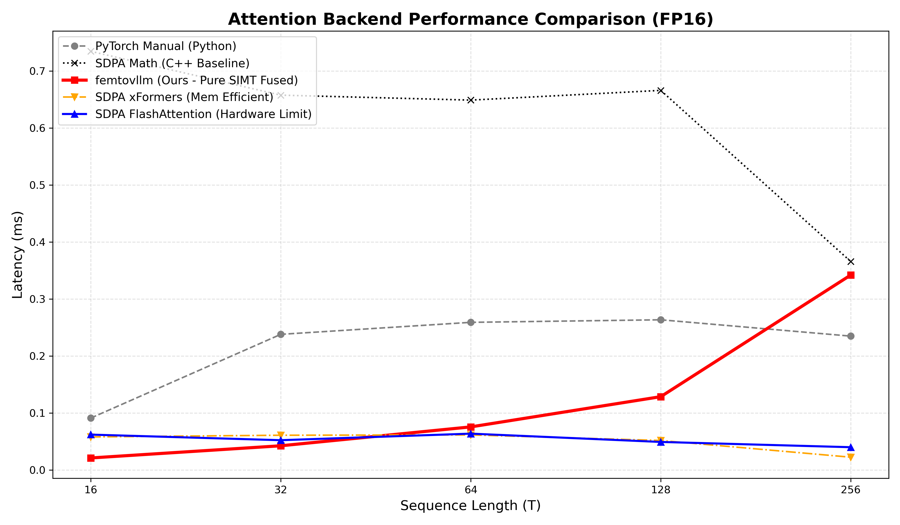
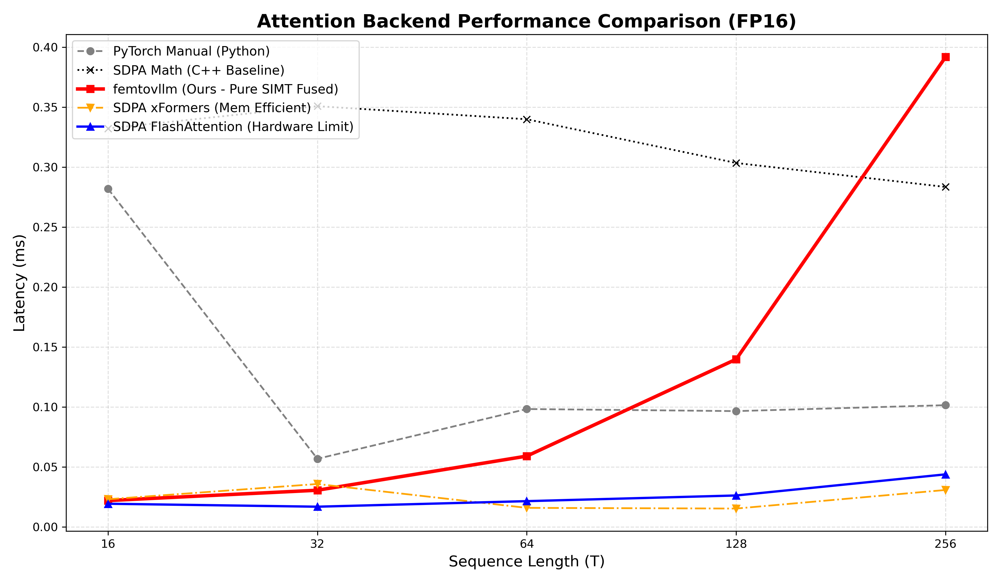

# FlashAttention Benchmarks & Profiling / 基准测试与性能分析

本目录用于自定义 FlashAttention CUDA 算子的性能评估、正确性测试以及底层硬件性能抓取。

---

# 当前测试结果

当seqlen较小时能有和SDPA接近的性能，当seqlen增大时由于未采用tensorcores性能差距开始变大。虽然重复运行了100次，但速度仍有波动，以下是三次benchmark.py的运行结果（run1和run2是经过挑选的较好的结果）。

## RUN1


| Seq_Len | Manual (ms) | femtovllm (Ours) (ms) | SDPA Math (ms) | xFormers (ms) | FlashAttention (ms) |
|---------|-------------|-----------------------|----------------|---------------|---------------------|
| 16      | 0.0865      | 0.0408                | 0.7229         | 0.0583        | 0.0629              |
| 32      | 0.2648      | 0.0326                | 0.6386         | 0.0564        | 0.0652              |
| 64      | 0.2607      | 0.0755                | 0.6709         | 0.0544        | 0.0654              |
| 128     | 0.2728      | 0.1140                | 0.2247         | 0.0166        | 0.0181              |
| 256     | 0.0575      | 0.3764                | 0.2560         | 0.0225        | 0.0304              |

## RUN2


| Seq_Len | Manual (ms) | femtovllm (Ours) (ms) | SDPA Math (ms) | xFormers (ms) | FlashAttention (ms) |
|---------|-------------|-----------------------|----------------|---------------|---------------------|
| 16      | 0.0912      | 0.0212                | 0.7344         | 0.0581        | 0.0621              |
| 32      | 0.2380      | 0.0426                | 0.6575         | 0.0611        | 0.0523              |
| 64      | 0.2591      | 0.0757                | 0.6488         | 0.0616        | 0.0638              |
| 128     | 0.2635      | 0.1287                | 0.6659         | 0.0518        | 0.0493              |
| 256     | 0.2349      | 0.3420                | 0.3657         | 0.0225        | 0.0400              |

## RUN3


| Seq_Len | Manual (ms) | femtovllm (Ours) (ms) | SDPA Math (ms) | xFormers (ms) | FlashAttention (ms) |
|---------|-------------|-----------------------|----------------|---------------|---------------------|
| 16      | 0.2820      | 0.0220                | 0.3323         | 0.0231        | 0.0193              |
| 32      | 0.0568      | 0.0306                | 0.3508         | 0.0358        | 0.0168              |
| 64      | 0.0983      | 0.0590                | 0.3399         | 0.0159        | 0.0215              |
| 128     | 0.0966      | 0.1398                | 0.3035         | 0.0153        | 0.0262              |
| 256     | 0.1015      | 0.3918                | 0.2835         | 0.0308        | 0.0438              |

## 测试环境搭建

搭建可能因平台不同而流程大不相同

作者的测试和分析是在windows和wsl2下运行的，同时在wsl2和windows侧都安装了nsys和ncu

nsys和ncu可以从
https://developer.nvidia.com/tools-overview
下载

wsl2内部做profile也需要在windows侧让所有用户能访问gpu性能计数器什么的


## Profiling Commands / 性能抓取命令速查

请在**当前目录**下执行以下命令，生成的分析报告将统一保存在 `reports/` 子文件夹中。该文件夹需要预先创建好

### Nsight Systems (`nsys`) - Macro Timeline / 宏观时间线
Profiles CPU-GPU interactions and kernel launch overheads.
抓取 CPU-GPU 交互与算子启动开销。

```bash
nsys profile \
    --trace=cuda,nvtx,osrt \
    --capture-range=cudaProfilerApi \
    --export=none \
    --output=reports/nsys_version_warp \
    --force-overwrite=true \
    python scripts/profile_version_warp.py
```

### Nsight Compute (`ncu`) - Micro Kernel Analysis / 微观算子分析
Profiles detailed hardware metrics (e.g., memory bandwidth, SM occupancy) for a specific kernel.
深入抓取特定算子的显存带宽、SM 占用率等底层硬件指标。

*Note: Change the `-k` parameter to match the specific kernel name you want to profile.*
*注：可通过修改 `-k` 参数来指定抓取不同的 Kernel。*

```bash
/usr/local/NVIDIA-Nsight-Compute/ncu --set full \
    -k "FlashAttentionWarpKernel" \
    -s 10 \
    -c 1 \
    -o reports/ncu_version_warp \
    -f \
    python scripts/profile_version_warp.py
```
